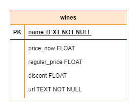
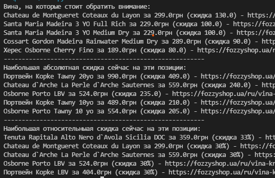

# Fozzy shop web parsing script #

I love wine very much. And even more I love discounts on wine.
Sometimes it can be very difficult to find great deals among the huge assortment of the store, for this I made this script that automates these processes and makes it easier for me to choose good drink for good price.

This script parses the page of sales wines using [BeautifulSoup](https://www.crummy.com/software/BeautifulSoup/bs4/doc/) and adds all information to database for easy further access and the ability to form various queries with convenient filters.

I have used [SQLite](www.sqlite.org) with such structure:

fozzy.py is scraping info and adds it to DB.  
db.py contains several queries that I use most often.  
main.py prints it in human readable form.  

output example of top-5 positions in 3 different queries:
